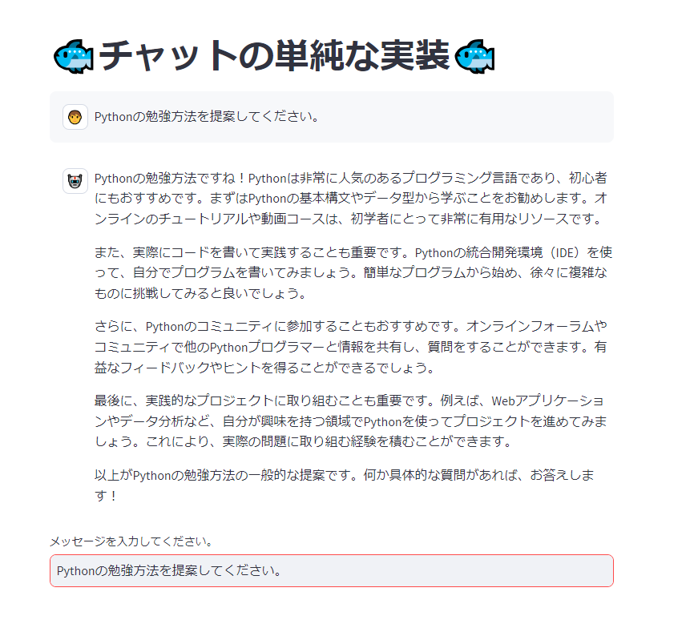

# Pythonを利用したOpenAI APIサンプル<!-- omit in toc -->

Pythonでの実装方法をいくつか紹介します。

- [環境準備](#環境準備)
  - [リポジトリのクローン](#リポジトリのクローン)
  - [仮想環境の作成](#仮想環境の作成)
  - [仮想環境のアクティブ化](#仮想環境のアクティブ化)
  - [利用ライブラリのインストール](#利用ライブラリのインストール)
  - [.envファイルの作成](#envファイルの作成)
  - [Open AIのアクセスキーの設定](#open-aiのアクセスキーの設定)
- [実行方法](#実行方法)
  - [シンプルな例](#シンプルな例)
  - [ChatGPTクローン](#chatgptクローン)
  - [外部データの活用（LlamaIndex）](#外部データの活用llamaindex)
  - [Function calling](#function-calling)
    - [APIキーの取得と設定](#apiキーの取得と設定)
- [付録](#付録)
  - [PDFのパース](#pdfのパース)


## 環境準備

事前にPythonはインストールされているものとします。

Pythonの基礎知識はSolxyz Academy「Python言語基礎」で学ぶことができます。

または[公式ドキュメント](https://docs.python.org/ja/3/)で学習してください。

### リポジトリのクローン

```PowerShell
git clone https://github.com/solxyz-jsn/gpt-sample-with-python.git
```

### 仮想環境の作成

```PowerShell
python -m venv gpt-sample
```

### 仮想環境のアクティブ化

```PowerShell
.\gpt-sample\Scripts\activate.ps1
```

### 利用ライブラリのインストール

```PowerShell
python -m pip install --upgrade pip
pip install -r requirements.txt
```

### .envファイルの作成

```PowerShell
New-Item .env
```

### Open AIのアクセスキーの設定

作成された`.env`ファイルを開き、以下を保存します。

```.env
OPENAI_API_KEY='あなたのアクセスキー'
```

## 実行方法

### シンプルな例

[simple_call.py](./src/simple_call.py)

Open AIのAPIを利用して回答を取得します。

```powershell
> python .\src\simple_call.py

「こんにちは、世界」と翻訳されます。
```

`content`に質問内容を渡しています。

```Python
# 日本語を英語に翻訳
response = openai.ChatCompletion.create(
  # エンジンの指定
  model="gpt-3.5-turbo",
  # ユーザーの発言として、日本語を入力
  messages = [
        {"role": "user", "content": "日本語に翻訳してください: '{Hello World}'"},
  ],
  max_tokens=60
)
```

### ChatGPTクローン

[chat_bot.py](./src/chat_bot.py)

[Streamlit](https://streamlit.io/)と組み合わせてChatGPT風のやりとりを行います。

```powershell
> streamlit run .\src\chat_bot.py

  You can now view your Streamlit app in your browser.

  Local URL: http://localhost:8501
  Network URL: http://192.168.68.111:8501
```

質問を入力すると問い合わせ結果が返却されます。



### 外部データの活用（LlamaIndex）

[llama_index_sample.py](./src/llama_index_sample.py)

このサンプルでは[LlamaIndex](https://gpt-index.readthedocs.io/en/latest/)を用いて外部データを利用します。

`data`フォルダーに読み込ませたい情報のテキストファイルなどを格納します。

初回実行時には次の箇所のコメントを解除して利用します。

格納したファイルが読み込まれ、インデックスを作成します。

```Python
# 実行ファイルのパス
dir_path = os.path.dirname(os.path.realpath(__file__))

# 外部データの読み込み（＊初回のみ実行）
documents = SimpleDirectoryReader(os.path.join(dir_path, "data")).load_data()
# インデックスの作成（＊初回のみ実行）
index = GPTVectorStoreIndex.from_documents(documents, service_context=service_context)
# インデックスの保存（＊初回のみ実行）
index.storage_context.persist()
```

コメントを解除して保存したら次のように実行します。

```powershell
> streamlit run .\src\llama_index_sample.py

  You can now view your Streamlit app in your browser.

  Local URL: http://localhost:8501
  Network URL: http://192.168.68.111:8501
```

ログを参照すると次のようにOpen AIの`embeddings API`とやり取りを行っていることがわかります。

```console
DEBUG:openai:message='Request to OpenAI API' method=post path=https://api.openai.com/v1/embeddings...
```

一度実施をすると、`storage`フォルダーに`.json`ファイルが作成され、再利用できます。（コメントを戻してください）

元のデータを更新した際には再実行が必要です。

質問を入力すると、再び`embeddings API`の呼び出しと、回答を得るために`completions API`の呼び出しが行われます。

```console
DEBUG:openai:message='Request to OpenAI API' method=post path=https://api.openai.com/v1/embeddings...
...
DEBUG:openai:message='Request to OpenAI API' method=post path=https://api.openai.com/v1/completions
```

これにより、インデックスされたデータを用いた回答が取得できます。


データの正しさは入力するデータに依存します。

入力データが曖昧であったり、データが不十分であれば、望んでいない回答になることがあります。

いかにデータをチューニングするのかはこの方式の課題となります。

> 動作の詳細は[LlamaIndex : ChatGPTで独自のデータに対して質問するためのフレームワーク](https://medium.com/axinc/llamaindex-chatgpt%E3%81%A7%E7%8B%AC%E8%87%AA%E3%81%AE%E3%83%87%E3%83%BC%E3%82%BF%E3%81%AB%E5%AF%BE%E3%81%97%E3%81%A6%E8%B3%AA%E5%95%8F%E3%81%99%E3%82%8B%E3%81%9F%E3%82%81%E3%81%AE%E3%83%95%E3%83%AC%E3%83%BC%E3%83%A0%E3%83%AF%E3%83%BC%E3%82%AF-4f87c82f2f92)が参考になります。

### Function calling

Function callingを利用すると、自分で定義した関数を組み込んでGPTとやり取りが行えます。

[function_calling.py](./src/function_calling.py)

ここでは[クラスメソッド社の記事 - OpenAI APIのFunction calling機能でGPTに検索結果に基づいた回答をさせてみる](https://dev.classmethod.jp/articles/function-calling-blog-search-and-answer/)を参考にソルクシーズ公認ブログを検索して、要約する画面を作成します。

#### APIキーの取得と設定

本サンプルを利用するためにはSerpApiのAPIキーの取得が必要です。

[SerpApi](https://serpapi.com/users/sign_up)で登録を行うと、月100回まで無料で検索を利用できます。

APIキーを取得したら、`.env`ファイルを開き、以下を保存します。

```.env
SERPAPI_API_KEY='あなたのアクセスキー'
```

本サンプルでは次の2つの関数を作成しています。

- ブログから入力に一致するURLを取得する`search_blog`
- ブログの内容をパースする`get_blog_contents`

function定義をJSONで渡してあげることで、APIが必要な関数を選んで応答してきます。

応答された関数名と引数から関数を呼び出して、再びAPIに渡します。

動作の詳細は元記事を参照してください。

次のように実行します。

```powershell
> streamlit run .\src\function_calling.py

  You can now view your Streamlit app in your browser.

  Local URL: http://localhost:8501
  Network URL: http://192.168.68.111:8501
```

検索ワードを入力すると、ブログを検索し、要約した結果を表示します。


## 付録

### PDFのパース

[extractpdf.py](./src/extract_pdf.py)

外部データを作成する際に利用できるPDFをテキスト化するスクリプトです。

PDFをそのまま読み込ませることも可能ですが、テキスト化することでデータを編集できます。
